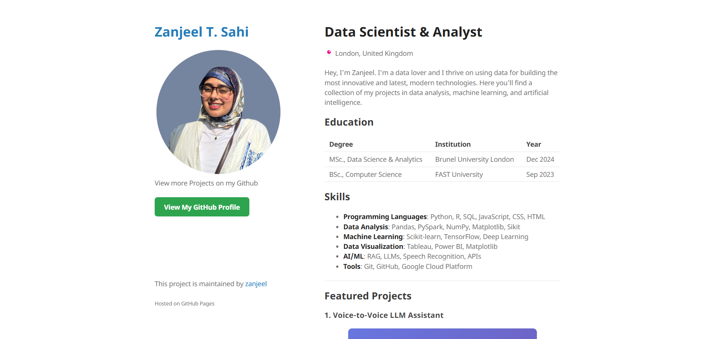

# Data Science Portfolio Template

[](https://github.com/zanjeel/Zanjeels-Data-Portfolio/stargazers)
[](https://github.com/zanjeel/Zanjeels-Data-Portfolio/network/members)
[](https://github.com/zanjeel/Zanjeels-Data-Portfolio/issues)
[](https://github.com/zanjeel/Zanjeels-Data-Portfolio/blob/main/LICENSE)

<div align="center">
  
  
  <h3>🚀 The Most Popular Data Science Portfolio Template</h3>
  <p>A modern, responsive portfolio template designed specifically for Data Scientists, Machine Learning Engineers, and Data Analysts.</p>

  <p>
    <a href="https://zanjeel.github.io/Zanjeels-Data-Portfolio">View Demo</a>
    ·
    <a href="https://github.com/zanjeel/Zanjeels-Data-Portfolio/issues">Report Bug</a>
    ·
    <a href="https://github.com/zanjeel/Zanjeels-Data-Portfolio/issues">Request Feature</a>
  </p>
</div>

---

## ⭐ Why Choose This Template?

Create a stunning portfolio website in minutes! This template is specifically designed for data professionals to showcase their projects, skills, and experience in a beautiful, modern layout.

- 🎯 **Purpose-Built**: Optimized for data science project showcases
- 📱 **Responsive**: Looks perfect on all devices
- 🎨 **Customizable**: Easy to modify and personalize
- 🚀 **Quick Setup**: Get your portfolio live in minutes
- 📊 **Project Focused**: Ideal for displaying data projects
- 🔧 **No Coding Required**: Simple configuration

## 📋 Features

<table>
  <tr>
    <td>✨ Modern Design</td>
    <td>📱 Responsive Layout</td>
    <td>🎯 Project Showcase</td>
  </tr>
  <tr>
    <td>📊 Skills Section</td>
    <td>👨‍🎓 Education Timeline</td>
    <td>💼 Work Experience</td>
  </tr>
  <tr>
    <td>📞 Contact Info</td>
    <td>🎨 Easy Customization</td>
    <td>🔧 Simple Setup</td>
  </tr>
</table>

## 🚀 Quick Start Guide

### Prerequisites

<details>
<summary>1. Install Ruby (2.5.0 or higher)</summary>

- **Windows**: Download from [RubyInstaller](https://rubyinstaller.org/)
- **Mac**: `brew install ruby`
- **Linux**: `sudo apt-get install ruby-full`
</details>

<details>
<summary>2. Install Bundler</summary>

```bash
gem install bundler
```
</details>

<details>
<summary>3. Install Git</summary>

- **Windows**: Download from [Git for Windows](https://gitforwindows.org/)
- **Mac**: `brew install git`
- **Linux**: `sudo apt-get install git`
</details>

### 🔥 One-Minute Setup

1. **Fork & Clone**
   ```bash
   git clone https://github.com/zanjeel/Zanjeels-Data-Portfolio.git
   cd Zanjeels-Data-Portfolio
   ```

2. **Install & Run**
   ```bash
   bundle install
   bundle exec jekyll serve
   ```

3. **View Your Site**: Open `http://localhost:4000` 🎉

## 💎 Customization

### 1. Basic Information
```yaml
# Edit _config.yml
title: Your Name
description: Data Scientist & Analyst
logo: /assets/img/your-photo.jpg
```

### 2. Add Your Content
Edit `index.md` to add:
- 📝 Introduction
- 🎓 Education
- 💻 Skills
- 🚀 Projects
- 💼 Work Experience
- 📞 Contact

### 3. Project Showcase
```markdown
### 🌟 Project Title


* 📝 **Description**: Your amazing project
* 💻 **Skills**: Python, ML, AI
* ✨ **Features**: Cool stuff it does
```

## 📸 Image Guidelines

| Type | Size | Format | Location |
|------|------|--------|----------|
| Projects | 500x500px | JPG/PNG | `/assets/img/` |
| Profile | 400x400px | JPG/PNG | `/assets/img/` |

## 🔧 Troubleshooting

<details>
<summary>Common Issues & Solutions</summary>

1. **Ruby Version Issues**
   ```bash
   ruby -v  # Check version
   rvm install 2.7.0  # Install specific version
   ```
2. **Bundle Install Fails**
   ```bash
   gem install bundler
   bundle update
   bundle install
   ```

3. **Jekyll Errors**
   ```bash
   bundle exec jekyll clean
   bundle exec jekyll build
   ```
</details>

## 📱 Responsive Design

Test your portfolio on all devices:
- 🖥️ Desktop (1920px+)
- 💻 Laptop (1366px)
- 📱 Tablet (768px)
- 📱 Mobile (375px)

## 🚀 Deploy to GitHub Pages

1. Go to repository settings
2. Navigate to "Pages"
3. Select `main` branch
4. Wait for deployment ⏳
5. Your site is live! 🎉

## 🤝 Contributing

Contributions are welcome! See [CONTRIBUTING.md](CONTRIBUTING.md) for ways to get started.

## 📄 License

This project is licensed under the MIT License - see the [LICENSE](LICENSE) file for details.

## 📧 Contact

Zanjeel T. Sahi - [zanjeel123@gmail.com](mailto:zanjeel123@gmail.com)

[](https://www.linkedin.com/in/zanjeel-tariq-sahi)
[](https://github.com/zanjeel)

---

<div align="center">
  Made with ❤️ by <a href="https://github.com/zanjeel">Zanjeel</a>
</div>

