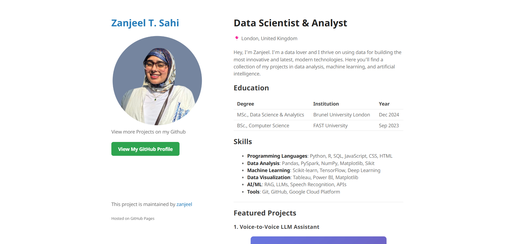

# Data Science Portfolio Template

A modern, responsive portfolio template designed specifically for Data Scientists, Machine Learning Engineers, and Data Analysts. Built with Jekyll and hosted on GitHub Pages.



## 🌐 Live Demo
View the live demo at: [https://zanjeel.github.io](https://zanjeel.github.io)

## ✨ Features
- Clean, modern design optimized for data science portfolios
- Responsive layout for all devices
- Project showcase with images and descriptions
- Skills and experience sections
- Education timeline
- Work experience section
- Contact information
- Easy to customize and deploy

## 🚀 Quick Start Guide

### Prerequisites
1. **Install Ruby (version 2.5.0 or higher)**
   - Windows: Download from [RubyInstaller](https://rubyinstaller.org/)
   - Mac: `brew install ruby`
   - Linux: `sudo apt-get install ruby-full`

2. **Install Bundler**
   ```bash
   gem install bundler
   ```

3. **Install Git**
   - Windows: Download from [Git for Windows](https://gitforwindows.org/)
   - Mac: `brew install git`
   - Linux: `sudo apt-get install git`

### Installation Steps

1. **Fork this repository**
   - Click the "Fork" button at the top right of this repository

2. **Clone your forked repository**
   ```bash
   git clone https://github.com/YOUR-USERNAME/data-science-portfolio.git
   cd data-science-portfolio
   ```

3. **Install dependencies**
   ```bash
   bundle install
   ```

4. **Run locally**
   ```bash
   bundle exec jekyll serve
   ```

5. **View your site**
   - Open your browser and go to `http://localhost:4000`

## 📝 Customization Guide

### 1. Basic Information
Edit `_config.yml`:
```yaml
title: Your Name
description: Data Scientist & Analyst
logo: /assets/img/your-photo.jpg
```

### 2. Update Content
Edit `index.md` to add your:
- Introduction
- Education
- Skills
- Projects
- Work Experience
- Contact information

### 3. Add Projects
For each project:
1. Add project image to `assets/img/`
2. Add project details in `index.md`:
   ```markdown
   ### Project Title
   
   * **Description**: Your project description
   * **Skills**: Technologies used
   * **Key Features**: Main features
   ```

### 4. Customize Styling
Modify the CSS in `index.md` to change:
- Colors
- Fonts
- Layout
- Spacing
- Image sizes

## 📸 Adding Images
1. **Project Images**
   - Size: 500x500px (recommended)
   - Format: JPG or PNG
   - Location: `assets/img/`
   - Optimization: Compress images for web

2. **Profile Photo**
   - Add to `assets/img/`
   - Update path in `_config.yml`

## 🔧 Troubleshooting

### Common Issues

1. **Ruby Version Errors**
   ```bash
   ruby -v  # Check version
   rvm install 2.7.0  # Install specific version
   ```

2. **Bundle Install Errors**
   ```bash
   gem install bundler
   bundle update
   bundle install
   ```

3. **Jekyll Build Errors**
   ```bash
   bundle exec jekyll clean
   bundle exec jekyll build
   ```

4. **Local Preview Not Working**
   - Check if port 4000 is free
   - Try `bundle exec jekyll serve --port 4001`

## 📱 Mobile Responsiveness
The template is mobile-responsive by default. Test your site on:
- Desktop (1920px and above)
- Laptop (1366px)
- Tablet (768px)
- Mobile (375px)

## 🚀 Deployment

### GitHub Pages
1. Go to repository settings
2. Enable GitHub Pages
3. Select `main` branch
4. Wait for deployment (usually 1-2 minutes)

### Custom Domain (Optional)
1. Add your domain in repository settings
2. Create CNAME record with your DNS provider
3. Add CNAME file to your repository

## 🤝 Contributing
1. Fork the repository
2. Create your feature branch
   ```bash
   git checkout -b feature/AmazingFeature
   ```
3. Commit your changes
   ```bash
   git commit -m 'Add some AmazingFeature'
   ```
4. Push to the branch
   ```bash
   git push origin feature/AmazingFeature
   ```
5. Open a Pull Request

## 📄 License
This project is licensed under the MIT License - see the [LICENSE](LICENSE) file for details.

## 📧 Contact
Zanjeel T. Sahi - [zanjeel123@gmail.com](mailto:zanjeel123@gmail.com)

Project Link: [https://github.com/zanjeel/data-science-portfolio](https://github.com/zanjeel/data-science-portfolio)

## 🙏 Acknowledgments
- Jekyll for the static site generator
- GitHub Pages for hosting
- All contributors who help improve this template
