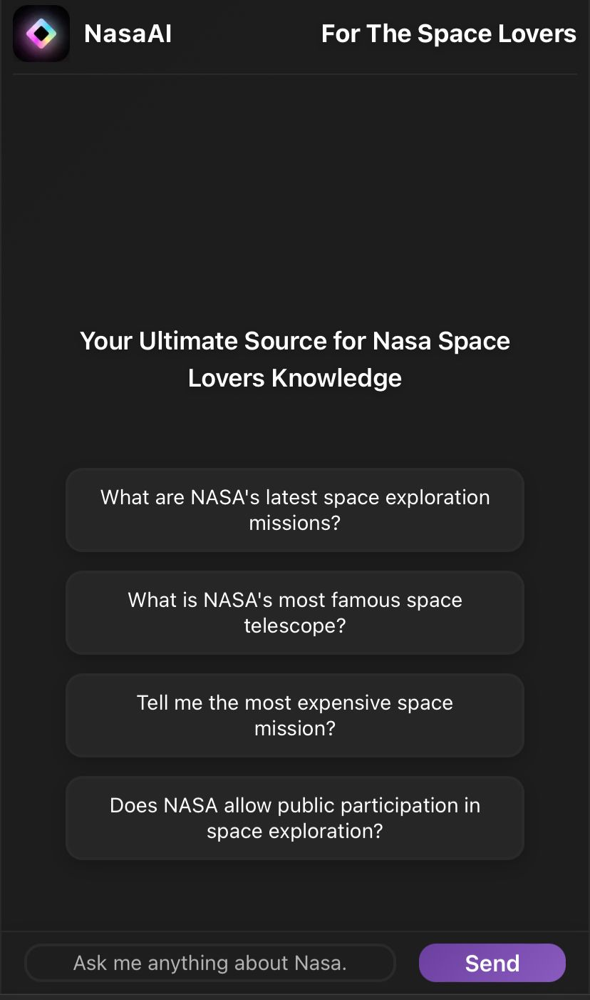
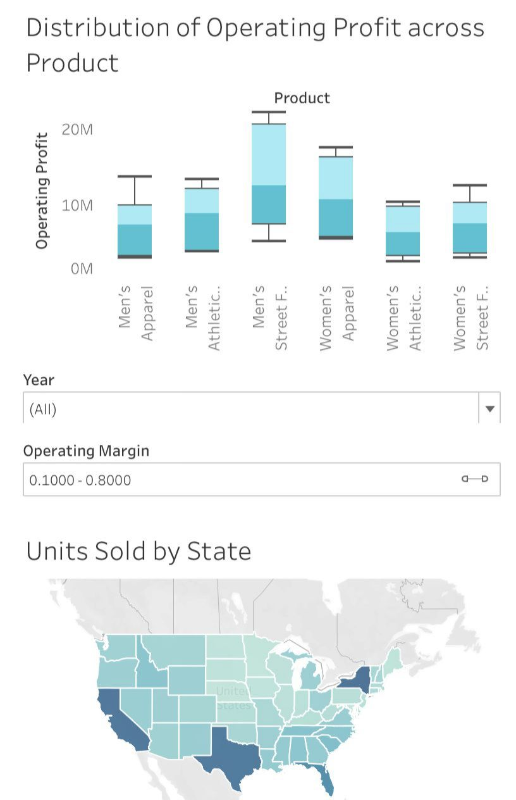

<meta name="viewport" content="width=device-width, initial-scale=1.0, maximum-scale=1.0, user-scalable=no, shrink-to-fit=no, viewport-fit=cover">

# Data Scientist & Analyst

📍 London, United Kingdom

Hey, I'm Zanjeel. I'm a Data Specialised Software Engineer with 3+ years of experience in software, data and AI across tech, health-tech, digital and IT industry sectors. I thrive on using data for building the most innovative and latest, modern technologies. 

## Education

| Degree | Institution | Year |
|:------:|:----------:|:----:|
| MSc., Data Science & Analytics | Brunel University London | Dec 2024 |
| BSc., Computer Science | FAST University | Sep 2023 |

---

## Work Experience

**Python Software Engineer @ Quickmeds, Birmingham (May 2025 - Present)**  
  QuickMeds, part of the Apothecare Ltd group with Franklin Pharmacy Birmingham, is a leading UK online healthcare provider serving 30K+ patients across 20+ countries, offering NHS and private prescriptions, reaching millions online.

**Developer @ Risidio, London (Jul 2024 - Jan 2024)**  
  Risido is a top-tier, London based IT firm with global clientele across 4 continents. 

 **Junior Software Engineer (Data Analytics) @ Half Full Studio, UAE (Jan 2024 - Jan 2023)**  
  Half Full Studio is a leading Dubai-based digital creative studio operating across 10+ countries, delivering campaigns for 500+ high-profile brands. Reason for Leaving: Pursuing a Full-Time Masters in Data Science. 

 **Engineer Intern @ Devsinc, USA (Oct 2022 - Jul 2022)**  
  Devsinc is a premier software firm, serving 50+ global clients across 20+ countries, with £10M+ in annual revenue. Being partners of industry giants, like Amazon, Google, and Salesforce, they deliver innovative technology solutions.

---

## Featured Projects

### 1. Voice-to-Voice LLM Assistant

* **Description**: A conversational AI assistant that uses speech-to-text and text-to-speech capabilities, powered by Python and Google's Gemini AI. Features real-time voice recording, processing, and witty responses in real time.

* **Skills**: Python, Flask, React, Google Gemini AI, Speech Recognition, gTTS (Google Text to Speech)

* **Key Features**: Real-time voice processing, natural dialogue, witty responses, LLM

[View Live Project](https://voice-to-voice-llm.vercel.app){: .project-button} [View on GitHub](https://github.com/zanjeel/Voice-to-Voice-LLM){: .github-button}

### 2. Advanced ML for Prediction in Automotive Systems

* **Description**: Predictive analysis of automobile data using RStudio, focusing on price prediction and market trends.

* **Skills**: R, Regression, KNN, Decision Trees, Random Forests

[View Live Project](https://zanjeel.github.io/Automobile-Predictive-Data-Analysis-RStudio/Automobile-Price-Prediction.nb.html){: .project-button} [View on GitHub](https://github.com/zanjeel/Automobile-Predictive-Data-Analysis-RStudio){: .github-button}

### 3. Mould Prediction for Hillingdon Council

* **Description**: Machine learning-based Mould prediction system developed for Hillingdon Council, UK, using various ML algorithms.

* **Skills**: Python, Tensorflow, Google Cloud Platform, LSTM, CNN, XGBoost, Time Series

* **Key Features**: Multiple ML models comparison, accurate mould forecasting, interactive visualizations

[View Live Project](https://zanjeel.github.io/Weather-Prediction-MachineLearningAlgorithms-HillingdonCouncilUK/MachineLearningModelsforWeatherPrediction.html){: .project-button} [View on GitHub](https://github.com/zanjeel/Weather-Prediction-MachineLearningAlgorithms-HillingdonCouncilUK){: .github-button}

### 4. Retrieval Augmentation Generation (RAG) AI Chatbot 

* **Description**: A Retrieval-Augmented Generation (RAG) powered by vector search and LLM reasoning, optimizing knowledge retrieval and conversational AI.

* **Skills**: Astra DB, Google Gemini API, Web Scraping, RAG, AI/ML, API Integration

* **Key Features**: Real-time space data retrieval, accurate space information, interactive Q&A interface

[View Live Project](https://rag-nasaai-spacelovers.onrender.com){: .project-button} [View on GitHub](https://github.com/zanjeel/RAG-NasaAI-SpaceLovers){: .github-button} 

### 5. DataAnalyserPro

* **Description**: A web-based data analysis tool that provides instant insights from Excel files without storing any data. Features rich visualizations and comprehensive statistics.

* **Skills**: Excel, React, TypeScript, Tailwind CSS

* **Key Features**: Privacy-first processing, rich visualizations, responsive design

[View Live Project](https://data-analyser-pro.netlify.app){: .project-button} [View on GitHub](https://github.com/zanjeel/DataAnalyserPro){: .github-button}

### 6. Data Visualisation and Insights Dashboards

#### Product Sales Insights

* **Description**: Data analysis and visualisation of product sales with interactive filters like Profit margin, product and year.

* **Skills**: Tableau, Sales Analytics, Interactive Visualization

* **Key Features**: Sales performance metrics, regional analysis, product category insights

[View Dashboard](https://public.tableau.com/app/profile/zanjeel.tariq.sahi/viz/AdidasSalesAnalaysisUSwithInteractiveFiltersforDeeperInsights/Dashboard){: .project-button}

### Airport Flight Perfomance Analysis and Insights - Power BI Dashboard

* **Description**: Interactive Power BI dashboard showcasing total flights, delays and satisfaction index of customers.

* **Skills**: Power BI, Data Visualization, Business Intelligence

* **Key Features**: Interactive filters, real-time data updates, responsive design

[Request Access](mailto:zanjeel123@gmail.com){: .project-button}

### Revenue and Profit Insights - Power BI Dashboard

* **Description**: Informative Power BI dashboard showcasing total revenue, sales and total products sold, which can be filtered by dynamic filters like profit per product and more.

* **Skills**: Power BI, Profit Margin, Finance, Total Revenue,  Business Intelligence

* **Key Features**: Dynamic filters, real-time data updates, Informative Visuals

[Request Access](mailto:zanjeel123@gmail.com){: .project-button}

#### Customer Insight Analysis

* **Description**: Interactive dashboard analyzing customer behavior and insights with interactive filters to visualise data by sales, gender and more.

* **Skills**: Tableau, Data Visualization, Business Analytics

* **Key Features**: Interactive filters, customer segmentation, trend analysis

[View Dashboard](https://public.tableau.com/app/profile/zanjeel.tariq.sahi/viz/CustomerInsightDataAnalysis/Dashboard){: .project-button}

---

## Skills

* **Programming Languages**: Python, R, SQL, JavaScript, MATLAB
* **Data Analysis**: Pandas, PySpark, NumPy, Matplotlib, Docker
* **Machine Learning**: Scikit-learn, TensorFlow, Deep Learning
* **Data Visualization**: Tableau, Power BI, DAX Queries, ggplot2 
* **AI/ML**: RAG, LLMs, Speech Recognition, APIs
* **Tools**: Git, GitHub, VSCode, Google Cloud Platform

---

## Awards & Honours

* **Dean's Honour List** 
  3.8/4 SGPA in Computer Science

* **Dean's Leadership Medal** 
  Built 12 Hand Gesture Controlled Robotic Vehicles

* **Chair, Brunel Data Science** 
  Mentored 300+ students, led 5+ hackathons  

* **Tech Speaker, Innovia UK Women in Tech**                          
  Keynote Guest Speaker on Data and AI

---

## Publications

* **Masters Dissertation**
  Evaluation of Machine Learning Models for Smart City Sensor Data Analysis across Edge AI and Centralised Architectures using Google Cloud Platform. https://doi.org/10.6084/m9.figshare.31043713

---

## Contact

* **GitHub**: [https://github.com/zanjeel](https://github.com/zanjeel)
* **LinkedIn**: [zanjeel-tariq-sahi](https://www.linkedin.com/in/zanjeel-tariq-sahi){:rel="noopener noreferrer"}
* **Email**: zanjeel123@gmail.com

---

_This portfolio is constantly updated with new projects and analyses. Check back regularly for updates!_
