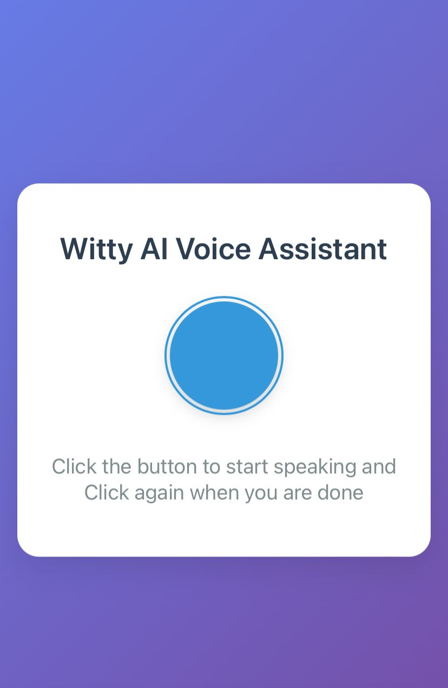
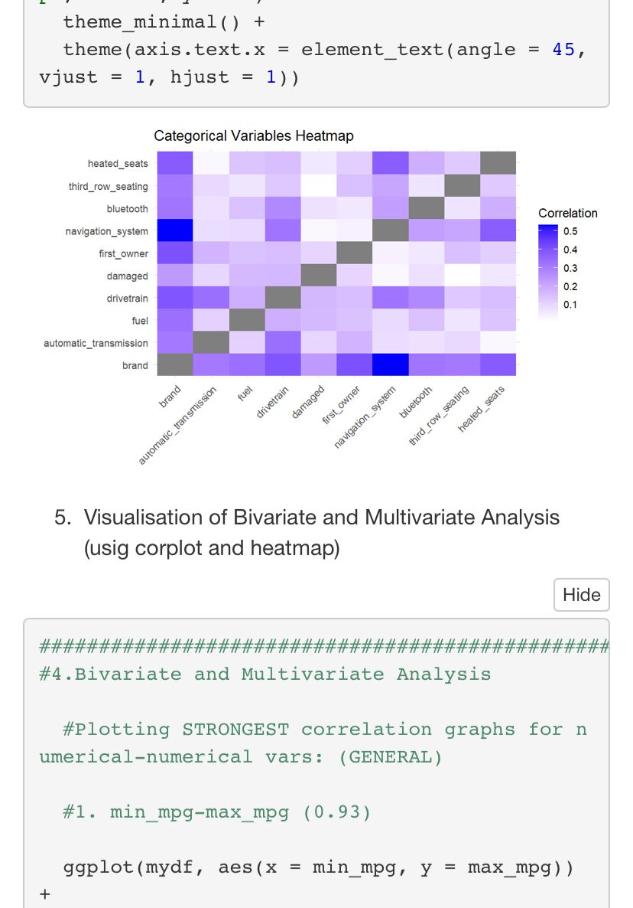
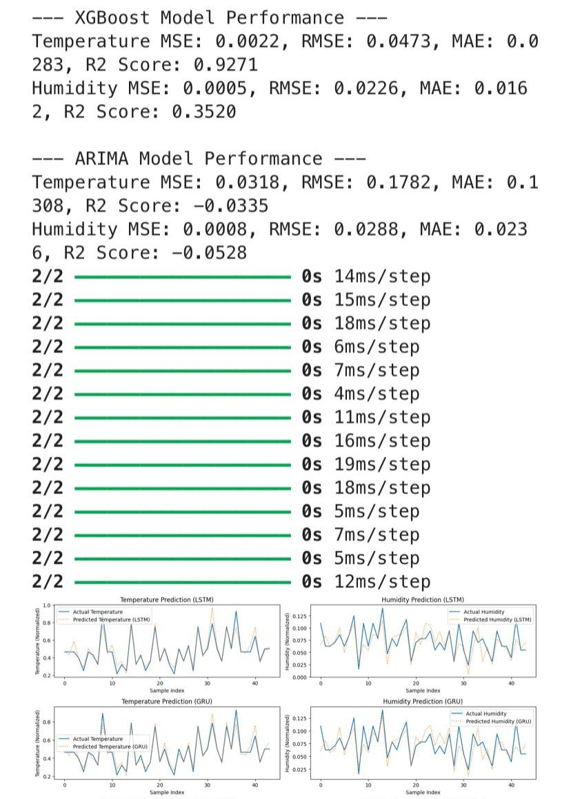
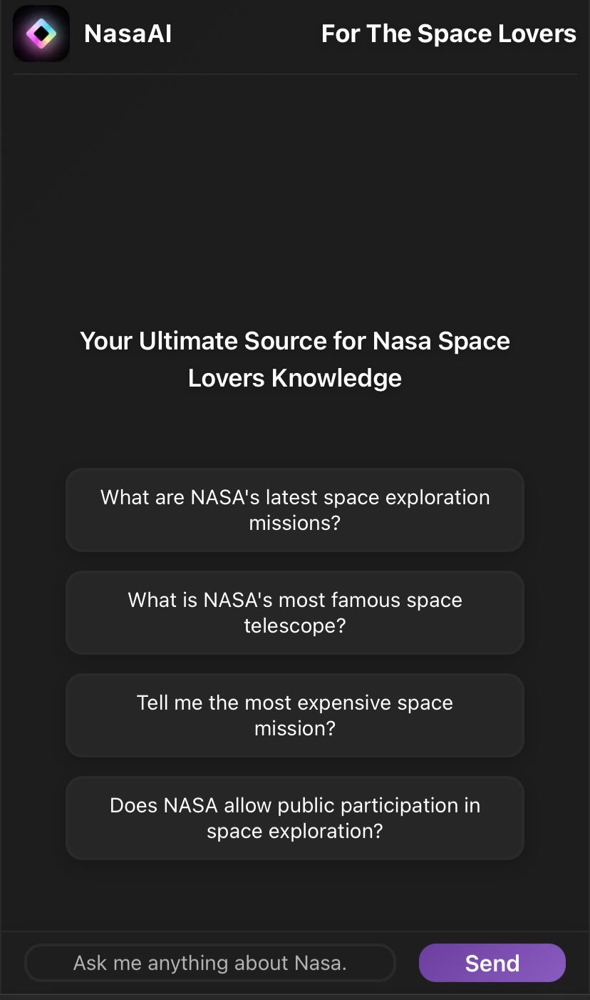
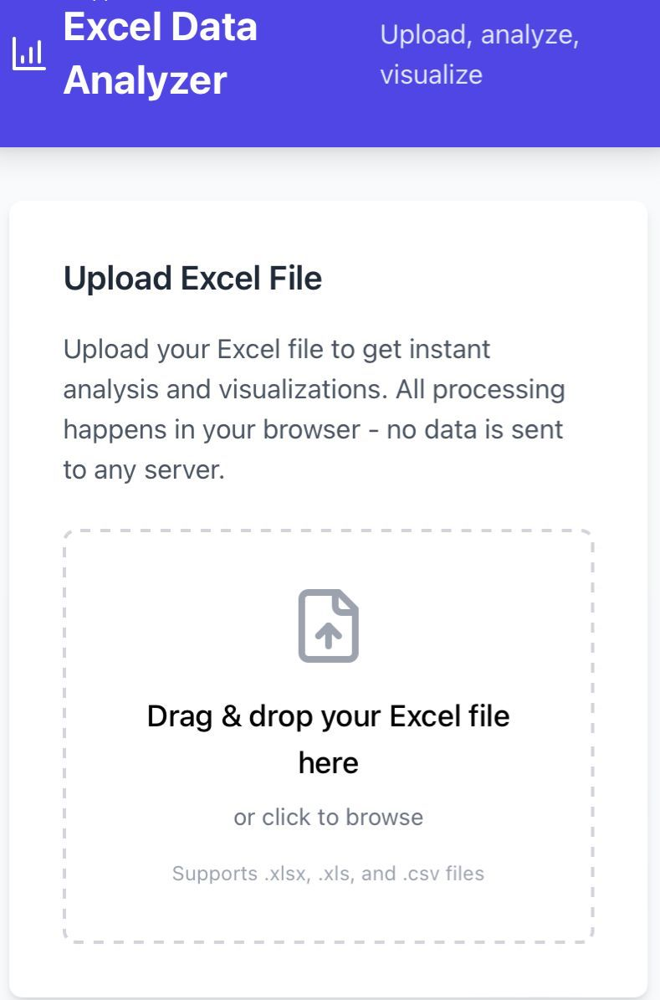
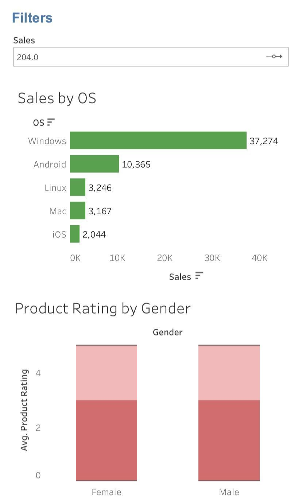
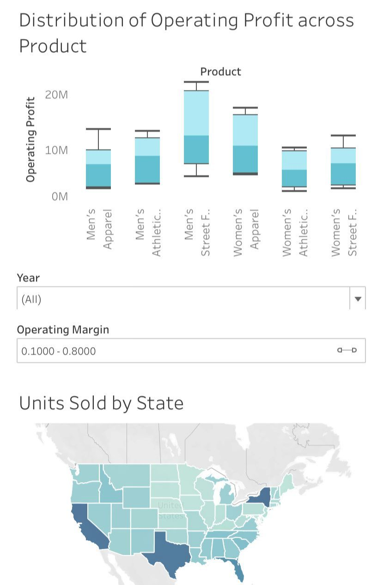

# Data Scientist & Analyst

📍 London, United Kingdom

Hey, I'm Zanjeel. I'm a data lover and I thrive on using data for building the most innovative and latest, modern technologies. 
Here you'll find a collection of my projects in data analysis, machine learning, and artificial intelligence.

## Education

* **MSc., Data Science & Analytics** - Brunel University London *(Dec 2024)*
* **BSc., Computer Science** - FAST University *(Sep 2023)*

## Skills

* **Programming Languages**: Python, R, SQL, JavaScript, CSS, HTML
* **Data Analysis**: Pandas, PySpark, NumPy, Matplotlib, Sikit 
* **Machine Learning**: Scikit-learn, TensorFlow, Deep Learning
* **Data Visualization**: Tableau, Power BI, Matplotlib
* **AI/ML**: RAG, LLMs, Speech Recognition, APIs
* **Tools**: Git, GitHub, Google Cloud Platform

---

## Featured Projects

### 1. Voice-to-Voice LLM Assistant

* **Description**: A conversational AI assistant that uses speech-to-text and text-to-speech capabilities, powered by Google's Gemini AI. Features real-time voice recording, processing, and witty responses in real time.

* **Skills**: Python, Flask, React, Google Gemini AI, Speech Recognition, gTTS (Google Text to Speech)

* **Key Features**: Real-time voice processing, natural dialogue, witty responses

[View Live Project](https://voice-to-voice-llm.vercel.app){: .project-button} [View on GitHub](https://github.com/zanjeel/Voice-to-Voice-LLM){: .github-button}

### 2. Automobile Predictive Analysis

* **Description**: Predictive analysis of automobile data using RStudio, focusing on price prediction and market trends.

* **Skills**: R, Predictive Modeling, Data Visualization

* **Key Features**: Real-time voice processing, natural dialogue, witty responses

[View Live Project](https://zanjeel.github.io/Automobile-Predictive-Data-Analysis-RStudio/Automobile-Price-Prediction.nb.html){: .project-button} [View on GitHub](https://github.com/zanjeel/Automobile-Predictive-Data-Analysis-RStudio){: .github-button}

### 3. Weather Prediction for Hillingdon Council

* **Description**: Machine learning-based weather prediction system developed for Hillingdon Council, UK, using various ML algorithms.

* **Skills**: Python, Machine Learning, Time Series Analysis

* **Key Features**: Multiple ML models comparison, accurate weather forecasting, interactive visualizations

[View Live Project](https://zanjeel.github.io/Weather-Prediction-MachineLearningAlgorithms-HillingdonCouncilUK/MachineLearningModelsforWeatherPrediction.html){: .project-button} [View on GitHub](https://github.com/zanjeel/Weather-Prediction-MachineLearningAlgorithms-HillingdonCouncilUK){: .github-button}

### 4. RAG-NasaAI SpaceLovers

* **Description**: A Retrieval-Augmented Generation (RAG) system for space-related queries, integrating NASA's data with AI capabilities.

* **Skills**: Python, RAG, AI/ML, API Integration

* **Key Features**: Real-time space data retrieval, accurate space information, interactive Q&A interface

[View on GitHub](https://github.com/zanjeel/RAG-NasaAI-SpaceLovers){: .github-button}

### 5. DataAnalyserPro

* **Description**: A web-based data analysis tool that provides instant insights from Excel files without storing any data. Features rich visualizations and comprehensive statistics.

* **Skills**: Excel, React, TypeScript, Tailwind CSS

* **Key Features**: Privacy-first processing, rich visualizations, responsive design

[View Live Project](https://data-analyser-pro.netlify.app){: .project-button} [View on GitHub](https://github.com/zanjeel/DataAnalyserPro){: .github-button}

### 6. Tableau Dashboards

#### Customer Insight Analysis
* **Description**: Interactive dashboard analyzing customer behavior and insights with interactive filters to visualise data by sales, gender and more.

* **Skills**: Tableau, Data Visualization, Business Analytics

* **Key Features**: Interactive filters, customer segmentation, trend analysis

[View Dashboard](https://public.tableau.com/app/profile/zanjeel.tariq.sahi/viz/CustomerInsightDataAnalysis/Dashboard){: .project-button}

#### Adidas Sales Analysis

* **Description**: Data analysis and visualisation of Adidas sales in the US with interactive filters like Profit margin, product and year.

* **Skills**: Tableau, Sales Analytics, Interactive Visualization

* **Key Features**: Sales performance metrics, regional analysis, product category insights

[View Dashboard](https://public.tableau.com/app/profile/zanjeel.tariq.sahi/viz/AdidasSalesAnalaysisUSwithInteractiveFiltersforDeeperInsights/Dashboard){: .project-button}

---

## Work Experience

* **Chair @ Data Science at Brunel London (Feb 2024 - Dec 2024)**  
  * Data Science Society at Brunel is a Leading Tech organisation increasing tech literacy amongst students.
  * Here I led weekly Programming sessions for 50+ students in a range of programming languages including C++, Python, R, SQL and more.

* **Developer Intern @ Risidio, London (Jan 2024 - Jun 2024)**  
  * Risido is a tech startup in London with a global client base.
  * Developed scalable software and web solutions, working with huge datasets to bring their own flagship 3D metaverse to life.
  * Built PowerPoint presentations to communicate findings to the CEO and 5+ dept., in non-technical, clear terms.

* **Software Engineer Intern @ Devsinc (Jul 2021 - Oct 2021)**  
  * Designed an ETL pipeline to process ~10GB+ datasets from multiple sources (.txt, Excel .CSV). This reduced manual search time by 70%.
  * Developed a data retrieval took using Ruby that searched for the data input by the user from a 20+ years of past records and returned the needed data. it also visualised the past data over a user entered time period.

---

## Transferable Experience

* **Founder and Chair | Brunel Data Science**  
  Mentored 300+ students, led 5+ hackathons  

* **Tech Speaker | Innovia UK Women in STEM**  
  Keynote Guest Speaker  

* **Theatrical Actor | NUCES University**  
  Selected from 500+ unis to perform for 1st lady of Pakistan  

* **VP Dramatics | NUCES University**  
  Led 5+ theatrical performances for 5,000+ attendees  

---

## Contact

* **GitHub**: [https://github.com/zanjeel](https://github.com/zanjeel)
* **LinkedIn**: [zanjeel-tariq-sahi](https://www.linkedin.com/in/zanjeel-tariq-sahi){:rel="noopener noreferrer"}
* **Email**: zanjeel123@gmail.com

---

_This portfolio is constantly updated with new projects and analyses. Check back regularly for updates!_
